# Creating and Managing Workspaces

A **workspace** is where your work in AgentWorX actually happens. Think of it as a dedicated project space that brings together your documents, your AI agents, your automated workflows, and the people who need access — all in one place, scoped to a single business context (for example, "Company Research" or "Invoice Processing").

Everything below covers how to find your existing workspaces, create a new one, and manage who has access to it.

---

## Finding Your Workspaces

All your workspaces live on the **Workspaces** page, accessible from the left-hand navigation.

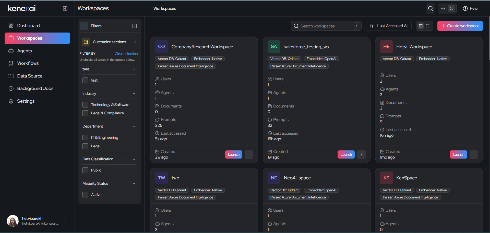

Each workspace is shown as a card (or a row, if you switch to list view) with a quick summary:

| Info shown | What it tells you |
|---|---|
| **Vector DB / Embedder / Parser** | The technical engines powering that workspace's document search and AI understanding (see [Integrations](./integrations.md) for details) |
| **Users** | How many people have access |
| **Agents** | How many AI agents are attached |
| **Documents** | How many files have been uploaded |
| **Prompts** | How many questions/messages have been sent in that workspace |
| **Created / Last accessed** | Timestamps for quick sorting |

You can:
- **Search** workspaces by name
- **Sort** by last accessed
- **Switch** between grid and list view
- **Filter** workspaces using tags like Industry, Department, Use Case, Region, Priority, and more (see [Managing Members and Metadata](#organizing-workspaces-with-tags) below)
- Click **Launch** on any workspace to open its chat interface, or use the **⋮** menu for quick actions — **Upload** (jumps straight to [Document Upload](./document-upload.md)) and **Settings** (opens [Workspace Settings](./workspace-settings.md)) — without launching the full chat view first

---

## Creating a New Workspace

Click **+ Create Workspace** on the Workspaces page. You'll go through a short, guided setup with the following steps. **General Details** and **Agents** are required; every other step is optional and can be skipped and configured later from **Workspace Settings**.

### Step 1: General Details

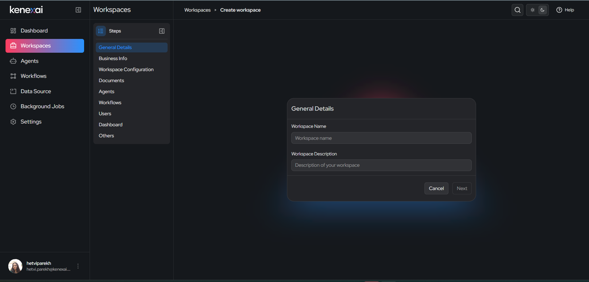

Give your workspace a **name** and a short **description**. This is the only required step — everything else can be filled in later.

### Step 2: Business Info

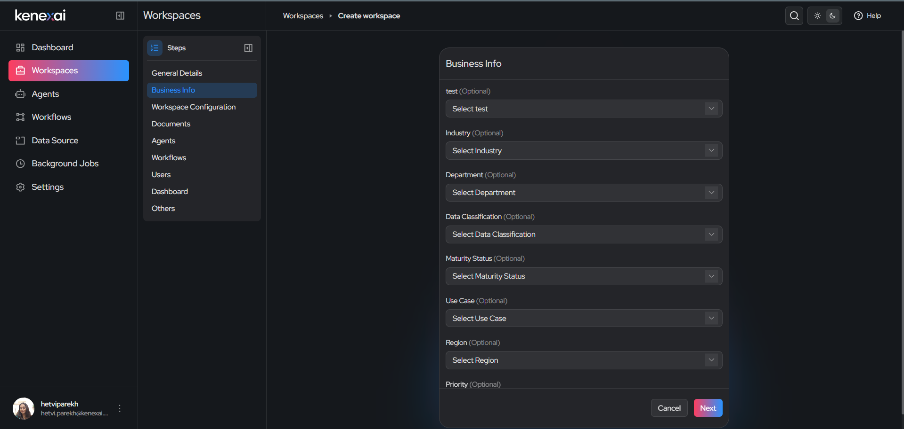

Tag your workspace with business context so it's easy to find and report on later. All fields here are optional:

- **Industry** — e.g. Finance & Banking, Healthcare & Life Sciences, Technology & Software (full list in [Supported Domains](./domains.md))
- **Department** — e.g. IT & Engineering, Legal
- **Data Classification** — e.g. Public, Confidential
- **Maturity Status** — e.g. Active, Pilot
- **Use Case, Region, Priority, Audience** — additional context tags

> **Tip:** If the option you need isn't in a dropdown, click **Add option** to create a new one. New options become available to everyone creating workspaces going forward.

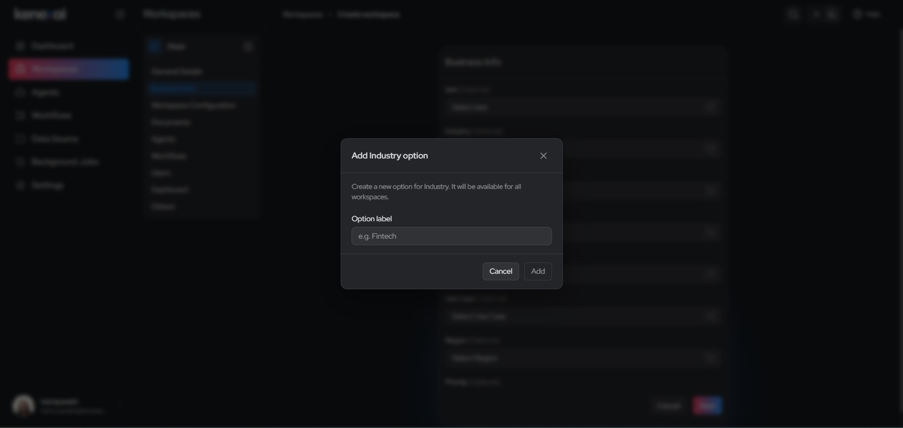

### Step 3: Workspace Configuration

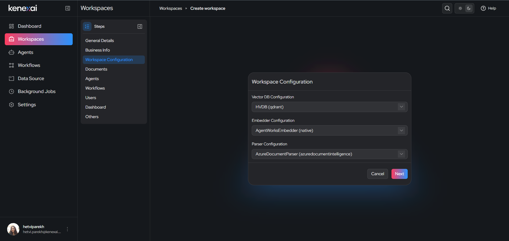

This is where you choose the technical engines behind your workspace:

- **Vector DB Configuration** — where your documents are indexed for AI search
- **Embedder Configuration** — the model that converts your documents into a format the AI can understand
- **Parser Configuration** — the tool that reads and extracts text from uploaded files (e.g. PDFs, scanned documents)

If you're not sure what to pick, use the default option — an admin can change this later. See [Integrations](../integrations.md) for what each option means.

### Step 4: Documents

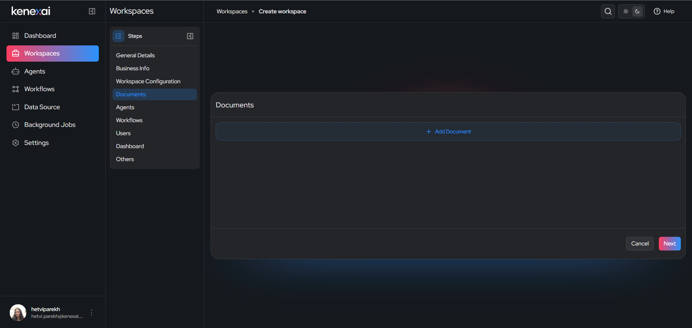

Optionally connect a document source right away — for example, a SharePoint or S3-type storage connector — so your workspace starts populated with existing files. You can also skip this and [upload documents directly](../document-upload.md) later.

### Step 5: Agents

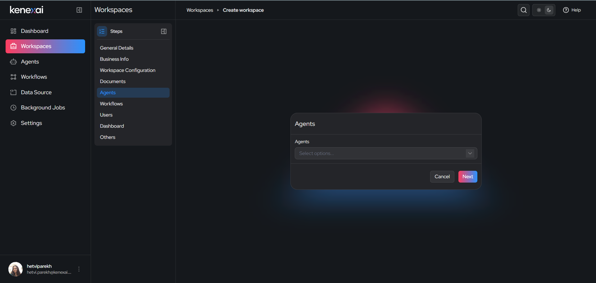

Attach one or more existing AI **agents** to this workspace. Agents are what your workspace's chat will use to answer questions and take actions. You can search and multi-select from all agents available to you.

> **This step is required** — a workspace must have at least one agent attached before it can be created.

### Step 6: Workflows

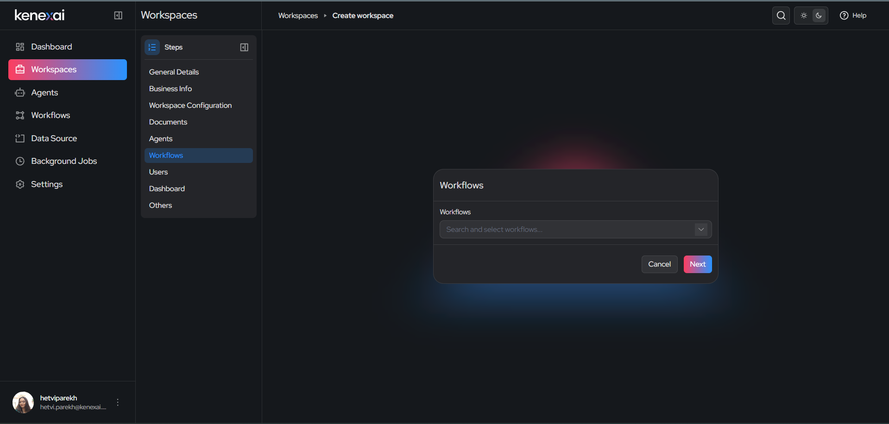

Attach existing automated **workflows** to the workspace by searching and selecting from the dropdown, the same way you attach agents. Workflows let the workspace trigger multi-step automated processes rather than a single agent response. This step is optional — skip it if the workspace doesn't need automated workflows.

### Step 7: Users

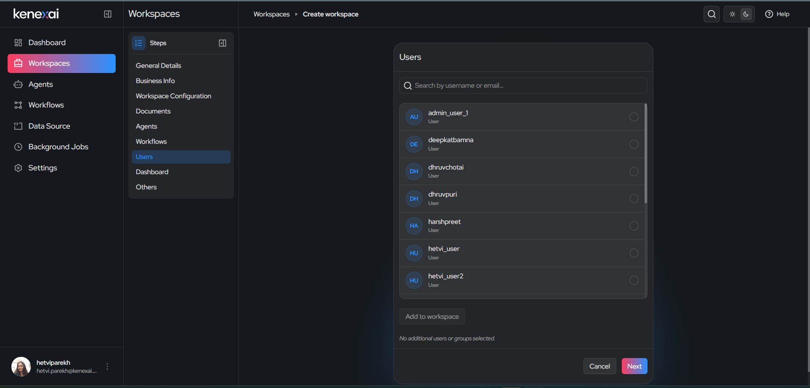

Add the people who should have access to this workspace. Search by username or email, select them, and click **Add to workspace**. You can assign roles (like **Admin** or **Member**) to control what each person can do — see [Managing Members](#managing-members) below.

### Step 8: Dashboard

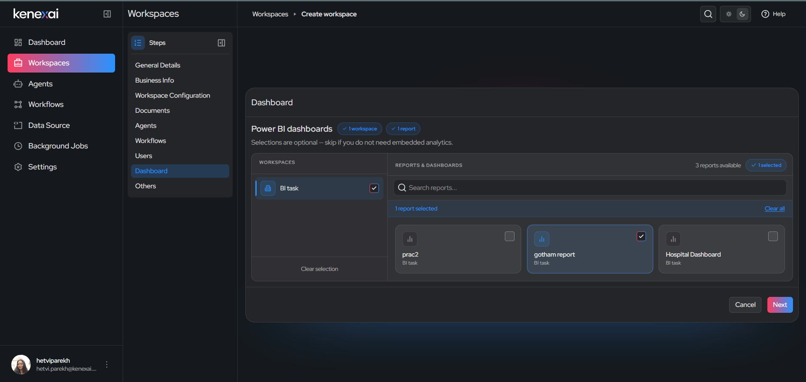

If your team uses **Power BI**, you can embed specific dashboards and reports directly into the workspace for quick reference. This step is entirely optional — skip it if you don't need embedded analytics.

### Step 9: Others

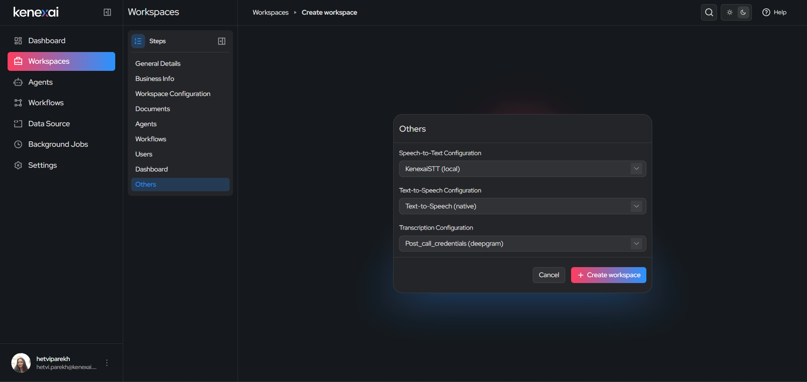

Configure voice-related capabilities for the workspace:

- **Speech-to-Text** — lets the workspace understand spoken input
- **Text-to-Speech** — lets the workspace respond with voice output
- **Transcription** — used for converting audio/meeting content into text

Once you're happy with your selections, click **Create Workspace**.

---

## Managing Members

You can manage who has access to a workspace at any time — not just during creation — from the workspace's settings.

You can assign each user one of two roles:

- **Admin** — can manage workspace settings, members, and configuration
- **Member** — can use the workspace (chat, upload documents, run agents/workflows) without managing its setup

To add, remove, or change a member's role, open the workspace and go to its member management section (see [Workspace Settings](./workspace-settings.md) for the full walkthrough).

## Organizing Workspaces with Tags

The tags you set in **Business Info** (Industry, Department, Use Case, Region, Priority, and more) aren't just for reference — they power the **filters** on the main Workspaces page. This is especially useful once your organization has many workspaces: you can quickly narrow the list down to, say, all "Legal & Compliance" workspaces in the "Active" maturity stage.

---

## What's Next

- [Document Upload](./document-upload.md) — add and manage files within a workspace
- [Workspace Chat](./workspace-chat.md) — using the chat interface once your workspace is set up
- [Workspace Settings](./workspace-settings.md) — changing configuration after creation
