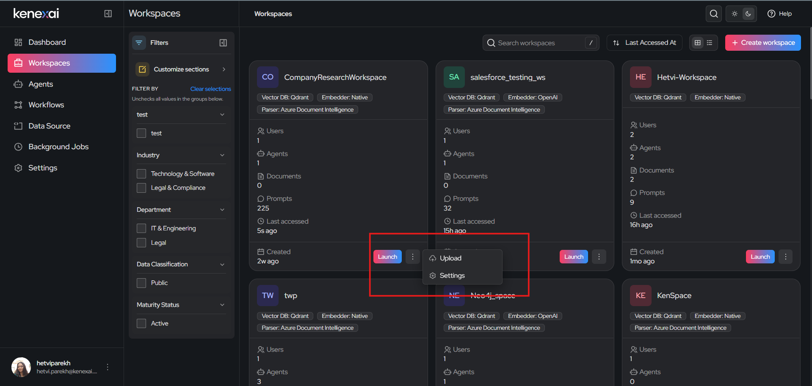
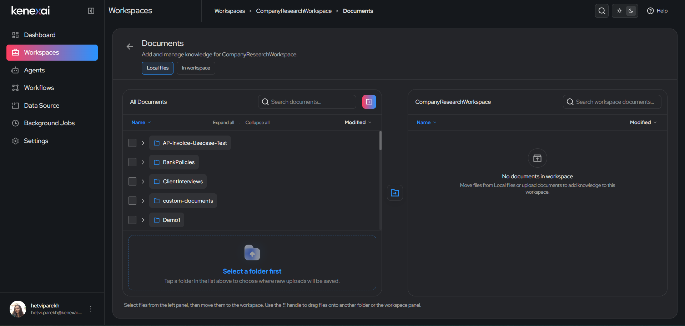

# Document Upload & Grounding

Uploading documents allows your LLMs to answer questions based on your private data. This is called **grounding** — instead of relying only on general knowledge, the AI agent references the actual content of your uploaded documents when responding in a workspace.

## Short Description

Document management in AgentWorX is organized as a two-panel file manager: a shared, organization-wide document library on one side, and the specific files attached to your workspace on the other. You move files from the library into your workspace to make them available for grounding.

## When to Use It

Use the Documents page whenever you want to:

- Add new files to your workspace so its agents can reference them
- Reuse a document that's already been uploaded to AgentWorX elsewhere, without re-uploading it
- Organize workspace knowledge into folders
- Remove documents from a workspace without deleting them from the wider library

## How to Get Here

- From the **Workspaces** list, click the **⋮** menu on any workspace card and select **Upload**.
- From inside a workspace's chat, click the **upload a document** link.

## The Documents Screen

The Documents page is split into two panels:

| Panel | Purpose |
|---|---|
| **All Documents** (left) | Your organization's full document library, organized into folders (e.g. `BankPolicies`, `ClientInterviews`, `custom-documents`). This is shared across workspaces. |
| **[Workspace Name]** (right) | The documents and folders currently attached to *this* workspace only. |

Above the left panel, two tabs control what you're browsing:
- **Local files** — browse the shared document library
- **In workspace** — browse only what's already been added to this workspace

### Adding Documents to Your Workspace

1. In the **All Documents** panel, select the folder or files you want to add.
2. Use the move/drag handle to drag the selection onto the workspace panel on the right — or use the transfer icon between the two panels.
3. If you're uploading something new rather than reusing an existing file, click the **+** (add) button above the All Documents panel to upload it into the library first.

> **Tip:** Before uploading a brand-new file, tap a folder in the left panel first — new uploads are saved into whichever folder is currently selected. If nothing is selected, you'll see a **"Select a folder first"** prompt.

## Supported Formats

AgentWorX supports a broad range of file types, grouped by how the content gets extracted for grounding:

| Category | Extensions |
|---|---|
| Text / markup | `.txt`, `.md`, `.org`, `.adoc`, `.rst`, `.html` |
| PDF | `.pdf` |
| Office | `.docx`, `.pptx`, `.xlsx`, `.odt`, `.odp` |
| Email | `.mbox` |
| E-book | `.epub` |
| Audio (transcribed) | `.mp3`, `.wav`, `.mp4`, `.mpeg`, `.m4a` |
| Images (OCR) | `.png`, `.jpg`, `.jpeg` |

> Files outside this list will fail to upload. Convert the file to a supported format first.

## Configuration Objects

| Setting | Description |
|---|---|
| **Folder structure** | Documents can be nested into folders both in the shared library and within a workspace, for easier organization |
| **Parser** | The document parser configured for the workspace (see [Workspace Configuration](./creating-and-managing.md#step-3-workspace-configuration)) determines how text is extracted from text-based and Office documents, and powers OCR for image files |
| **Transcription Configuration** | Audio files (`.mp3`, `.wav`, `.mp4`, `.mpeg`, `.m4a`) are converted to text using the workspace's transcription setup (see [Step 9: Others](../creating-and-managing.md#step-9-others)) before they can be used for grounding |
| **Personal SharePoint** | If enabled by an admin in [Workspace Settings](./workspace-settings.md), members can connect their own Microsoft account and pull files directly from their personal SharePoint on this same upload page |

## Expected Outputs

- Once a document is moved into the workspace panel, it becomes available for grounding — the workspace's agents can reference it in chat.
- The workspace's **Documents** count (visible on the [Workspaces list](./creating-and-managing.md#finding-your-workspaces)) updates to reflect the current contents of the workspace panel.
- Removing a document from the workspace panel detaches it from that workspace but does **not** delete it from the shared library.

## Edge Cases and Limits

- **Unsupported file types** (anything outside the table above) will fail to upload.
- **No folder selected**: new uploads can't be saved until you select a destination folder in the left panel.
- **Scanned or image-heavy PDFs, and standalone images** depend on OCR quality — poor scans or low-resolution images may reduce grounding accuracy.
- **Audio files** depend on transcription accuracy — background noise, overlapping speakers, or heavy accents may reduce grounding accuracy.
- **Personal SharePoint uploads** require Azure AD SSO to be configured under Admin settings before members can use that option.
- **Maximum file size**: individual files can be up to **2 GB**. Files larger than this will fail to upload.
- Per-workspace document count limits are not yet confirmed — check with your workspace admin if you hit an upload error on a large file.
